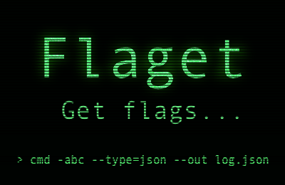

# Flaget


Minimal, fast CLI flag parser for Node.js.
Parse command-line arguments into a clean JSON object with support for grouped short flags,
aliases, multi-value keys, default values, and more.

## Features

- Grouped short flags: `-abc`
- Long flags with values: `--key=value` or `--key value`
- Short-to-long aliases: `-f` = `--files`
- Multi-value keys: `--files a.js b.js`
- Default values for flags
- Supports positional arguments and `--` terminator

## Install

```bash
npm i flaget
```

## Usage

### Basic

```js
const getFlags = require('flaget');
// or, in ESM:
// import getFlags from 'flaget';

const flags = getFlags();
// Parses process.argv.slice(2) by default
console.log(flags);
```

### With Options

```js
const flags = getFlags({
  argv: ['build', '-abc', '--mode=production', '--dash-flag=value', '-f', 'a.js', 'b.js', 'c.js', '--files', 'd.js', '--', 'input.txt'],
  aliases: { f: 'files', m: 'mode' },      // -f = --files, -m = --mode
  arrays: ['files'],               // collect multiple values for --files and -f
  defaults: { mode: 'dev', verbose: false } // default values if not set in CLI
});

console.log(flags);
```

**Result:**

```json
{
  "a": true,
  "b": true,
  "c": true,
  "mode": "production",
  "dash-flag": "value",
  "dashFlag": "value",
  "files": [
    "a.js",
    "b.js",
    "c.js",
    "d.js"
  ],
  "_": [
    "build",
    "input.txt"
  ]
}
```

---

## Options

| Option     | Type       | Default                  | Description                                                   |
|------------|------------| ------------------------ |---------------------------------------------------------------|
| `argv`     | string[]   | `process.argv.slice(2)`  | Array of CLI arguments to parse                               |
| `aliases`  | Object     | `{}`                     | Map of short keys to long keys.<br>Example: `{ f: 'files' }`  |
| `arrays`   | string[]   | `[]`                     | Keys that should collect multiple values as arrays            |
| `defaults` | Object     | `{}`                     | Default values for flags, if not set on the CLI               |

### Returns

An object with flags, camelCased flags, and positional arguments in the `_` property.

## Supported CLI Flag Formats

| CLI Input Example                | Parsed Output Example                         | Notes                                       |
|----------------------------------|-----------------------------------------------|---------------------------------------------|
| `-a`                             | `{ a: true }`                                 | Single short flag                           |
| `-abc`                           | `{ a: true, b: true, c: true }`               | Grouped short flags                         |
| `--flag`                         | `{ flag: true }`                              | Long flag (boolean)                         |
| `--key=value`                    | `{ key: 'value' }`                            | Long flag with value                        |
| `--key value`                    | `{ key: 'value' }`                            | Long flag, value in next argument           |
| `-f value`                       | `{ f: 'value' }`                              | Short flag with value                       |
| `--number 42`                    | `{ number: 42 }`                              | Auto-casts numbers                          |
| `--bool false`                   | `{ bool: false }`                             | Auto-casts booleans                         |
| `-f a.js b.js`<br>`--files c.js` | `{ f: ['a.js', 'b.js'], files: ['c.js'] }`    | Multi-value keys: groups following values   |
| `--dash-flag=value`              | `{ 'dash-flag': 'value', dashFlag: 'value' }` | Kebab-case key, also available as camelCase |
| `--files a.js b.js -- c.js`      | `{ files: ['a.js', 'b.js'], _: ['c.js'] }`    | Arguments after -- are positional           |
| `input.txt`                      | `{ _: ['input.txt'] }`                        | Positional argument                         |
| `-f a.js --files b.js`           | `{ f: ['a.js'], files: ['b.js'] }`            | Aliases resolved                            |


## Example CLI

```bash
node cli.js build -abc --mode=prod --dash-flag=value -f a.js b.js --files c.js -- input.txt
```

**Parses as:**

```json
{
  "a": true,
  "b": true,
  "c": true,
  "mode": "prod",
  "dash-flag": "value",
  "dashFlag": "value",
  "files": ["a.js", "b.js", "c.js"],
  "_": ["build", "input.txt"]
}
```

## Notes

- **CamelCase:** All dashed keys are also available as camelCase (e.g. `--foo-bar` sets both `foo-bar` and `fooBar`).
- **Aliases:** Use the `aliases` option to map short flags to long names.
- **Multi-value keys:** Specify in `arrays` to collect an array of values.
- **Defaults:** Use the `defaults` option for fallback values.